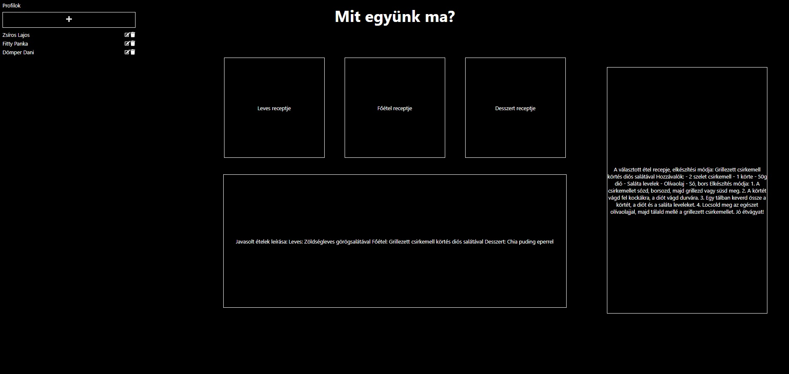

# Étel Javaslati Alkalmazás

Ez az alkalmazás ReactJS-t és Node.js-t használ a ChatGPT API-val való kommunikációhoz, hogy étel javaslatokat generáljon a felhasználók számára.

## Függőségek

- `react`: A felhasználói felület megalkotásához használt könyvtár.
- `react-icons/fa`: Ikonok a felhasználói felület díszítéséhez.
- `axios`: HTTP-kérések végrehajtásához a backend szerverrel vagy külső API-kkal, mint például a ChatGPT API.

## Környezeti beállítások

Az alkalmazás használatához szükséges a saját OpenAI API kulcsod.
Helyettesítsd a `veryecretkey` részt a saját OpenAI API kulcsoddal a `.env` fájlban. 
Ez a kulcs szükséges az alkalmazás működéséhez.

## Funkciók és Működés

1. **Profil Létrehozása**: A felhasználó a bal oldali "Profilok" szekció alatt található plusz ikonra kattintva megjeleníthet egy új profil űrlapot, amely kitölthető és elmenthető.
2. **Profil Kiválasztása**: Egy profil nevére kattintva a felhasználó betöltheti az adott felhasználó adatait.
3. **Étel Javaslatok**: A "Mit együnk ma?" gombra kattintva az alkalmazás elküldi a kiválasztott profil adatait a ChatGPT API-nak, amely válaszként étel javaslatokat generál és azok megjelennek az "Javasolt ételek" dobozban az oldal alján.
4. **Receptek Lekérése**: A felhasználó a kapott ételjavaslatok alapján kérhet recepteket a "Leves receptje", "Főétel receptje" és "Desszert receptje" dobozokra kattintva. A kiválasztott étel kategória receptjei és elkészítési módjai a jobb oldali "Tartalom" dobozban jelennek meg.

## Megjegyzések

- Az alkalmazás nem tárolja az adatokat hosszú távon, tehát minden oldalfrissítés vagy újranyitás után újra be kell állítani a profilokat.
- Ha az API válasza nem megfelelő, próbálkozzon újra a profil kiválasztásával és az ételjavaslatok generálásával.
- Ha a UI undorítóan jelenik meg zoom-olgasson ki/be addig amíg értelmes elrendezésbe kerül :D .

## Telepítés és Indítás

A projektet letöltheti a GitHub-ról. A forráskód módosításához, futtatásához és a fejlesztéshez ajánlott a Visual Studio Code használata.

A telepítéshez és az alkalmazás helyi szerveren való futtatásához kövesse az alábbi lépéseket:

```bash
git clone git@github.com:nandorfivince/etkezesi-tervezo.git
cd etkezesi-tervezo
npm install
npm start
```


